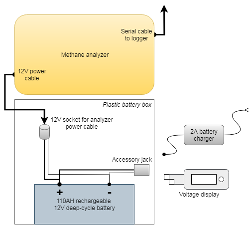

# Methane (CH4) Tracer Study

Source code and documentation for methane tracer release plume dispersion study.
There are two main components:

* A stationary release site with
    * 3D ultrasonic anemometer ([CSAT3B; Campbell Scientific](https://www.campbellsci.com/csat3b))
    * Regulated point-release of CH4:
        * 99.0% (commercial purity) methane ([Matheson Tri-Gas](http://www.mathesontrigas.com/))
        * high-purity, dual-stage regulator with flash arrestor
        * 5 SLPM mass flow controller ([Alicat Scientific](https://www.alicat.com/product/gas-mass-flow-controllers/))
          with flash arrestor
* And a mobile station with:
    * Methane (CH4)/carbon dioxide (CO2) analyzer ([UGGA; Los Gatos Research](http://www.lgrinc.com/analyzers/ultraportable-greenhouse-gas-analyzer/)
    * GPS receiver ([GPS16X-HVS; Garmin](https://www.campbellsci.com/gps16x-hvs))
    * Programmable datalogger ([CR6; Campbell Scientific](http://www.campbellsci.com/cr6))

The mobile station can be located up to 40m (130ft) from the stationary release
site. Position data is logged in real-time to relieve the operator of tracking
sampling location. 

An Android tablet computer is used to interact with system
components. Both the logger and gas analyzer have dedicated wireless networks
for administration via appropriate apps:

* For the datalogger, [LoggerLink](https://play.google.com/store/apps/details?id=com.campbellsci.loggerlink&pageId=none)
  provides complete control and data monitoring capabilities
* For the CH4 analyzer, [VNC Viewer](https://play.google.com/store/apps/details?id=com.realvnc.viewer.android&hl=en_US)
  allows the tablet to substitute for monitor/keyboard/mouse hardware

## Operating Procedures

See [here](sop.md).

## Diagrams

### Experimental Hardware

### Methane Release Hardware

### Logger Enclosure Diagram

### Analyzer Setup Diagram

## Data stuff

Raw measurements are stored at 10Hz and, where appropriate, aggregated to 1-min 
values. Data is retained to microSD card memory; there is no telemetry component.

Two data tables files are generated each time the datalogger is started or after
12 hours of runtime. Runs are distinguished by a numeric filename suffix. 

* `ch4plume-tsdata`: raw time-series data recorded at 10Hz
* `ch4plume-stats`: one-minute aggregations of select values; more for quality control

Field names (columns) contain a prefix indicating the data source. Refer to
comments for a brief description, or the relevant instrument manual for more
details on a particular field.

* `csat3b`: sonic anemometer
* `ugga`: methane analyzer
* `gps`: GPS receiver
* `logger`: data logger

## References

* Alicat Scientific. *MC/MCD Mass Flow Controller Manual.* Rev 42, 2017 May 22.
  Online: <https://www.alicat.com/documents/manuals/Gas_Flow_Controller_Manual.pdf>

* Campbell Scientific, Inc. *CR6 Measurement and Control System Operator's
  Manual.* Revision 2018 Dec 19. 
  Online: <https://s.campbellsci.com/documents/us/manuals/cr6.pdf>

* Campbell Scientific, Inc. *CRBasic Program Reference: WindVector.* Version
  CR1000.Std.32. CRBasic Editor.

* Campbell Scientific, Inc. *CSAT3B Three-Dimensional Sonic Anemometer.* Revision
  2018 Mar. Online: <https://s.campbellsci.com/documents/us/manuals/csat3b.pdf>

* Campbell Scientific, Inc. *GPS16X-HVS GPS Receiver Instruction Manual.*
  Revision 2017 Oct. Online: <https://s.campbellsci.com/documents/us/manuals/gps16x-hvs.pdf>

* Los Gatos Research. *Ultra-Portable Greenhouse Gas Analyzer (UGGA) User Manual
  Model 915-0011.* Revision 2016 Jul 22. 
  > *By manufacturer request only - see hardcopy or Lab Manager for pdf.*

