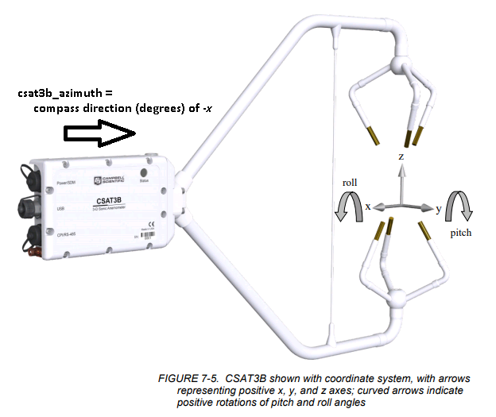

# Standard Operating Procedures for Methane Plume Dispersion Experiment

Users must be familiar with operating procedures and safety guidelines **before**
using experimental hardware! Review all material presented below and direct
questions to the Laboratory Manager.

> For complete experimental details, including diagrams and references, see
> <https://github.com/patricktokeeffe/ch4-plume-study>

## Safety Precautions

* **FLAMMABLE GASES**  
  Methane is a flammable gas! Even at low release rates, a potentially
  combustible mixture will be generated in the immediate vicinity of the
  release tube (up to several inches). Keep all sources of spark or flames away
  from the tracer release hardware!
* **BATTERY HAZARDS**  
  The methane analyzer operates on a non-sealed lead-acid deep-cycle battery.
  To prevent dangerous chemical spills, do not place the battery on its side.
  Recharge the battery only in ventilated laboratory facilities to prevent
  dangerous build-up of combustible by-products.
  > *The smaller batteries used in the data system and tracer release enclosure
  > are sealed and may be used safely in any orientation.*
* **TRIPPING HAZARD**  
  The anemometer data cable is quite long and not highly visible - exercise
  caution to avoid tripping. 

## Setup & Takedown

### Gas Analyzer Cart

The gas analyzer, battery and datalogger enclosure make up the monitoring
equipment - assemble them on the portable handcart as follows. Take-down is the
reverse procedure (after powering devices off). 

> Before use, verify the 12V deep-cycle battery has been fully recharged! 
> The minimum operating voltage is 12.0 and **recommended starting voltage is
> 13.0+ Vdc**. See *Battery Levels* below for more details.

1. Extend the handcart handles and fold down the platform
2. *Add the battery:*
    1. Place the battery box & strap onto the platform.
    2. Put the deep-cycle battery into the enclosure and slide against the wood block.
    3. Connect the analyzer 12V power cable to the battery's 12V outlet.
    4. Cover the enclosure and strap the lid down. Both the voltage monitor and analyzer power cable should be accessible. 
3. *Add the analyzer:*
    1. Set the analyzer on top of the battery enclosure and secure to handle
       with a bungee cord.
    2. Connect the gas filter (clear with white cone) to **<kbd>INLET</kbd>** port.
    3. Connect the muffler (black tube)  to **<kbd>WASTE</kbd>** port.
    4. Finally, with **<kbd>POWER</kbd>** switch *off*,  connect power cable to the **<kbd>10 - 30 VDC</kbd>** port.
4. *Add the datalogger:*
    1. Hang the white datalogger enclosure from the cart's handle and secure with
       bungee cord.
    2. Open the enclosure and pull the gas analyzer data cable through the bottom wall fitting.
    3. Connect the data cable to the gas analyzer **<kbd>SERIAL</kbd>** port (opposite power side)

The monitoring site now ready to turn on - see below under *Operations*.

### Sonic Anemometer

Follow this procedure to setup the anemometer. For takedown, follow these steps
in reverse. 

1. Fold tripod legs out, then extend as necessary to accommodate uneven ground.
   Position the tripod so crossbar is roughly horizontal.
2. Hang sandbags from the tripod to prevent tipping.
3. Attach the anemometer mounting bracket to the tripod crossbar. Position the
  bolt vertical pointing upward. 
4. Attach the anemometer to the mounting bracket bolt. Use the bubble level to
   ensure the sensor is plumb (vertical both axes). 
5. Connect the anemometer power/data cable to the **<kbd>Power/SDM</kbd>** port.
6. Finally, connect the anemometer to the ethernet coupler in the logger enclosure.

The sonic will automatically operate once the datalogger is powered on. Once
the program is running, you can specify the direction of the anemometer. This
value is used in the statistics table to track the position of the anemometer
(useful for quality control) and to calculate the true wind direction. 

> **After setting up or moving the sonic anemometer, always specify its new
> orientation in the program. See below: *To update the sonic azimuth***

### Tracer Release

Next, setup the methane release hardware:

1. Remove the protective cap from the external delivery tube.
2. Lift the left side of the upper tray to access the methane bottle valve. Open the valve counter-clockwise (CCW) **one half turn** to supply gas to the regulator.
3. Verify the regulator indicates the correct pressures:
    * Left side (delivery): approximately 15 psig
    * Right side (inlet): between 15 and 2000 psig
4. Reach through the upper tray slot and turn the power supply *on*. The voltage indicator will display a voltage and the flow controller will turn on. 
    > The **minimum operating voltage is 12.0** Vdc. See *Battery Levels* below for more details.
5. Verify the release rate displayed by the flow controller matches your expectations. To program a new setpoint, see below under *Operations*.

To shut down the methane release hardware:

1. *First,* lift the left side of the upper tray and **close the valve** of the methane bottle by turning clockwise (CW). Use firm resistance only, not a strong torque, to avoid damaging the valve.
2. Wait until the regulator gauges show zero to indicate the flow path is fully depressurized.
3. Set the flow controller set point to **0.000** SLPM. 
4. Reach through the upper tray slot and turn the power supply *off*. 
5. Place the cap back onto the external delivery tube.

## Operation

### To turn devices ON

* Data system:
    * Turn the battery regulator power switch to **ON**
    * The 'power' and 'WiFi' indicators will flash to indicate operation
* Tracer release:
    * Turn the battery regulator power switch (lower level) to **ON**
    * The battery voltage display and mass flow controller will both turn on
* Methane analyzer:
    * Flip the power switch to **ON** (green light turns on)
    * Wait up to **2 minutes** for data system routines to engage
    * The analyzer is running when the pump turns on

### To turn devices OFF

* Data system:
    * Turn the battery regulator power switch to **OFF**
    * Verify the LED indicators no longer light up
* Tracer release:
    * De-pressurize the flow path anytime the device is not in use
    * Shut off the gas supply using the bottle valve
    * Turn the battery regulator power switch to **OFF**
    * Verify the bottle is closed after use
* Methane analyzer:
    * Connect to the gas analyzer's graphical interface via wifi (see *To view the gas analyzer interface* below)
    * Shut down the data acquisition software using the **EXIT** button
    * Wait for **1 minute** after being disconnected to allow the operating system to shutdown
    * Finally, turn the power switch **OFF**

### To monitor battery voltage

**All components are battery operated. If any of the batteries dies, the
experiment must stop! Check battery voltages frequently to ensure there is
sufficient power (>=12.0) to safely shutdown the analyzer.**

* Data system:
    * view field `logger_batt` in the *Public* or  *_debug* tables for current value
    * the same field is viewable in the *stats* table, but value represents 1-minute average
* Tracer release:
    * check voltmeter display adjacent to power switch
* Methane analyzer:
    * press gray button on voltmeter adapter to see current voltage

### To recharge the batteries

The batteries may be recharged in any of the LAR labs. Follow the steps below
to begin charging and perform reverse procedure when charging finishes. 

> *Do not charge the batteries in a car, home or other enclosed space.*

* Data system:
    * verify the system is off
    * plug the 3-prong cord of the AC power adapter into a power source
    * the red LED illuminates to indicate charging
* Tracer release:
    * verify the system is off
    * plug the 24Vdc power adapter into a power source
    * the red LED illuminates to indicate charging
* Methane analyzer battery:
    * disconnect the gas analyzer from the battery (use caps to keep terminals clean)
    * disconnect the voltmeter from accessory jack
    * with the DieBold battery charger unplugged, connect output to the battery's accessory jack 
    * plug the battery charger into a power source
    * wait for orange charging light to turn on (turns green when finished)

### To change the release setpoint

1. Press <kbd>SETPT</kbd>
2. Press <kbd>SELECT</kbd> to choose the desired decimal place
3. Press the <kbd>UP</kbd> and <kbd>DOWN</kbd> buttons to change the value
4. Press <kbd>SET</kbd> to select a value, <kbd>CLEAR</kbd> to return to zero, or <kbd>CANCEL</kbd> to abort

### To update the sonic azimuth

1. Connect to the logger interface (see below)
2. On the *Current* tab, load the data table *Public*
3. Press the value for field `csat3b_azimuth` to edit it
4. Enter the new compass direction of the anemometer
5. Press *OK* to save.

The compass direction of the anemometer is determined by where it "aims" as per
this diagram (image courtesy *Campbell Scientific CSAT3B User Manual*).

### To view the gas analyzer interface

* Connect the tablet to the analyzer's wifi network (`ZyXel-xxxxxx`)
* Launch the **VNC Viewer** app
* Select a saved shortcut to connect to the analyzer. (*Multiple entries exist
  to accommodate the analyzer's dynamic IP address. If one fails, try another.*) 
    * Press anywhere on screen and drag your finger to manipulate the mouse cursor
    * Press once to send a mouse left-click
    * Press and hold to send a mouse right-click

### To monitor data in real-time

* Connect the tablet to the datalogger's wifi network (`CR6_xxxx`)
* Launch the **LoggerLink** app
* Select the CR6 datalogger entry to connect to the logger
    * Use the *Current* tab to monitor numeric values in a list format.  
    * Use the *Historical* tab to select data for time-series plotting. 
    * Use the *Collect* tab to download records and view data in a table.

### To access data files

All data files are stored to microSD memory card. A new file is generated any
time the datalogger powers on or the program is restarted. 

To exchange the logger memory card:
1. Remove the protective cap from the datalogger's **<kbd>MicrosSD</kbd>** port.
2. Press the nearby **<kbd>Eject</kbd>** button to halt data storage.
3. After the card indicator turns **solid green**, pull out the microSD card.
4. Insert a blank microSD card to resume data storage.
5. Place the protective cap back over the **<kbd>MicrosSD</kbd>** port.

Once files are retrieved, they must be converted from the binary storage format]
into readable plain-text. The plain text file can be opened in a text editor or
Microsoft Excel. To convert the files:
1. Install the no-cost [PC208W (Campbell Scientific)](https://www.campbellsci.com/pc200w) application bundle
2. Launch the **Card Convert** program from this application suite
3. Select the microSD card as the source directory
4. Select a destination directory
5. Start by pressing *Start Conversion*

## Battery Levels

The usable range of battery voltage is roughly **12.0 to 13.0+ Vdc**. Stop the
experiment at 12.0V to ensure there is enough capacity left to safely shutdown
the analyzer. 

> *Batteries will be damaged by over discharge - do not allow batteries to
> drain below 11.8V!* 

| Battery level | Analyzer (deep-cycle battery) | Logger & CH4 release (AGM battery) |
|:--:|:--:|:--:|
| 100% | >12.7 V | >13.0 V |
|  75% | 12.4 V | 12.7 V |
|  50% | 12.2 V | 12.4 V |
|  25% | 12.0 V | 12.0 V |
| **DEAD** | 11.8 V | 11.8 V |

Especially for the large deep-cycle battery, the relationship between voltage
and state-of-charge is non-linear. Check the voltage several times per 
hour -- a full battery will run for at least 6 hours.

Example voltage vs. time measurements:
* no load voltage (open circuit): 13.0 V
* voltage during analyzer boot: 12.8 V
* voltage once analyzer begins running: 12.4 V
* voltage 2-3 hours later: 12.3 V

